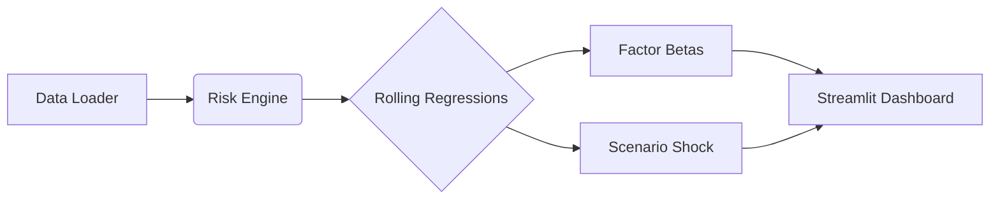

# Global Risk Dashboard

This repository contains a modular, **institutional-grade risk monitoring system** designed to decompose portfolio risk in real-time. It mimics the "prop shop" style of analytics, focusing on:

  * **Real-time Data Ingestion** (via custom data loaders)
  * **Factor Risk Decomposition** (Rolling Ridge Regression Betas)
  * **Coherent Scenario Analysis** (Historical stress testing)
  * **Live Visualization** of factor exposures

The project is structured as a **production-lite application**, separating the core calculation engine from the visualization layer to ensure scalability and clean architecture.

## 1\. Project Overview

### The Core Goal

**How can we decompose complex multi-asset risk into actionable factor exposures?**

To answer this, the project builds a Python-based risk engine that ingests market data and fits rolling regression models to determine exactly what is driving asset returns (e.g., Rates, VIX, Global Growth) across different time zones.

### Key Features

**Universe:**

  * **Multi-Asset Capabilities:** Designed to handle Equities, ETFs, and potentially Futures/FX.
  * **Region-Specific Logic:** Auto-detection of asset regions (JP, KR, HK, CN, US) to apply appropriate factor timing.

**Risk Engine (`src/risk_engine.py`):**

  * **Factor Risk Decomposition:** Calculates rolling betas to key macro factors using **Ridge Regression** to handle multicollinearity.
  * **Timezone Synchronization:** Implements intelligent lag logic (e.g., lagging US factors like `^VIX` for Asian market closes) to ensure accurate regression alignment across global markets.
  * **Coherent Scenario Generation:** Generates realistic stress tests (e.g., "Shock VIX +20%") by identifying historical stress periods and scaling the associated factor moves, rather than applying arbitrary shocks.

## 2\. Technical Architecture

The project follows a clean "Data $\to$ Engine $\to$ View" architecture:



| Component | File | Description |
| :--- | :--- | :--- |
| **Data Layer** | `src/data_loader.py` | Handles API connections (`yfinance`) and timestamp synchronization. |
| **Logic Layer** | `src/risk_engine.py` | The mathematical core. Handles rolling regressions, region inference, and timezone adjustments. |
| **Config** | `src/config.py` | Centralized settings for tickers, lookback windows, and factor preferences (`IDX_PREF`, `FX_PREF`). |
| **Visualization** | `src/charts.py` | Plotly wrappers for generating standardized risk plots (Heatmaps, Rolling Betas). |
| **Entry Point** | `main.py` | The executable script that ties everything together to launch the dashboard. |

## 3\. Installation & Usage

### Prerequisites

  * Python 3.8+
  * Virtual Environment (recommended)

### Setup

1.  **Clone the repository**

    ```bash
    git clone <repo_url>
    cd global_risk_dashboard
    ```

2.  **Create and Activate Virtual Environment**

    ```bash
    # Windows
    python -m venv .venv
    .\.venv\Scripts\activate

    # Mac/Linux
    python3 -m venv .venv
    source .venv/bin/activate
    ```

3.  **Install Dependencies**

    ```bash
    pip install -r requirements.txt
    ```

4.  **Run the Dashboard**

    ```bash
    streamlit run main.py
    ```

## Appendix: Math Foundations

### Factor Risk Decomposition (Ridge Regression)

To understand *where* risk comes from, we decompose portfolio returns ($R_p$) into exposures to common risk factors ($F$) using a rolling window (default 252 days).

The base model is a linear regression:

$$R_{p,t} = \alpha + \beta_1 F_{Mkt,t} + \beta_2 F_{Rates,t} + \beta_3 F_{Vol,t} + \epsilon_t$$

Where:

  * $\beta_i$: The sensitivity (risk loading) to factor $i$.
  * $\epsilon_t$: The idiosyncratic (specific) risk of the portfolio.

**Why Ridge Regression?**
Financial factors are often highly correlated (e.g., Rates and Equities during inflation shocks). Standard OLS estimates can be unstable and "jumpy" under these conditions (Multicollinearity).

To fix this, we use **Ridge Regression (L2 Regularization)**, which adds a penalty term to the minimization problem:

$$\hat{\beta}_{Ridge} = \arg\min_{\beta} \left( \sum_{t=1}^{T} (R_{p,t} - X_t\beta)^2 + \lambda \sum_{j=1}^{p} \beta_j^2 \right)$$

  * $\lambda$ (Lambda): The regularization parameter (set to 1.0 in code).
  * **Result:** More stable risk attributions that don't flip wildly day-to-day.

-----

*Disclaimer: This project is for educational and research purposes. It is not financial advice and should not be used for live trading without extensive validation.*
